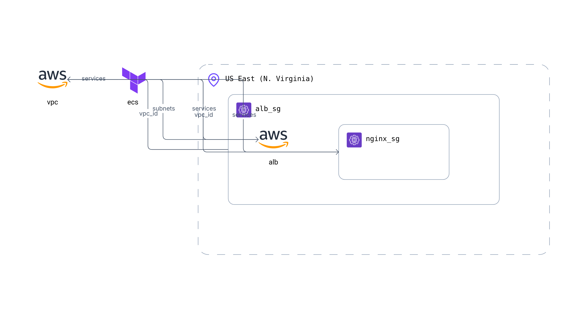

# AWS-ECS (monolith) 

This is an example repository containing Terraform and Ansible code. It contains the code to deploy a demo Event-Driven Pub/Sub application on ECS.

## Tree
```
.
├── misc
│   └── Brainboard.png    # Generated with https://app.brainboard.co
├── README.md
└── terraform
    ├── main.tf
    ├── outputs.tf
    └── provider.tf
```

## Architecture diagram



## Infracost

```shell
 Name                                   Monthly Qty  Unit              Monthly Cost

 module.vpc.aws_nat_gateway.this[0]
 ├─ NAT gateway                                 730  hours                   $32.85
 └─ Data processed                   Monthly cost depends on usage: $0.045 per GB

 module.alb.aws_lb.this[0]
 ├─ Application load balancer                   730  hours                   $16.43
 └─ Load balancer capacity units     Monthly cost depends on usage: $5.84 per LCU

 OVERALL TOTAL                                                              $49.28

*Usage costs can be estimated by updating Infracost Cloud settings, see docs for other options.

──────────────────────────────────
30 cloud resources were detected:
∙ 2 were estimated
∙ 28 were free

┏━━━━━━━━━━━━━━━━━━━━━━━━━━━━━━━━━━━━━━━━━━━━━━━━━━━━┳━━━━━━━━━━━━━━━┳━━━━━━━━━━━━━┳━━━━━━━━━━━━┓
┃ Project                                            ┃ Baseline cost ┃ Usage cost* ┃ Total cost ┃
┣━━━━━━━━━━━━━━━━━━━━━━━━━━━━━━━━━━━━━━━━━━━━━━━━━━━━╋━━━━━━━━━━━━━━━╋━━━━━━━━━━━━━╋━━━━━━━━━━━━┫
┃ terraform                                          ┃           $49 ┃           - ┃        $49 ┃
┗━━━━━━━━━━━━━━━━━━━━━━━━━━━━━━━━━━━━━━━━━━━━━━━━━━━━┻━━━━━━━━━━━━━━━┻━━━━━━━━━━━━━┻━━━━━━━━━━━━┛
```

## Helpful informations

https://elasticscale.com/blog/why-your-aws-ecs-task-is-stuck-in-pendingand-what-to-do-about-it/

To get information on task in case it is stuck in `PENDING` status:
```shell
aws ecs describe-services --cluster event-driven-ecs --services app
```
