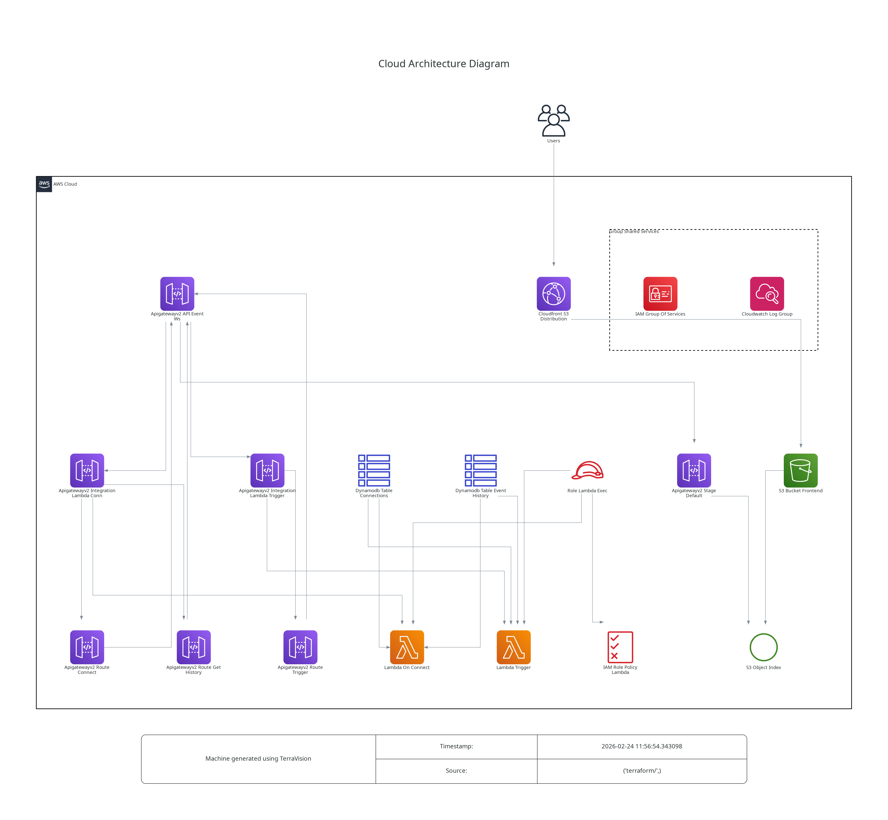

# AWS-S3+Lambda+DynamoDB

This is an example repository containing Terraform code. It contains the code to deploy a demo Event-Driven Pub/Sub application with S3, Lambda and DynamoDB.  
We are using Api gateway and Cloudfront to expose the application.

## Tree
```
.
├── app
│   ├── lambda.zip
│   ├── on_connect.py
│   ├── requirements.txt
│   ├── trigger_event.py
│   └── zip.sh                # Helper script to run to generate lambda.zip
├── misc
│   └── architecture.dot.png  # Generated with https://github.com/patrickchugh/terravision.
├── README.md
└── terraform
    ├── iam.tf
    ├── main.tf
    ├── outputs.tf
    ├── provider.tf
    ├── s3.tf
    ├── templates
    │   └── index.html.tftpl
    └── variables.tf
```

## Architecture diagram



## Infracost

```shell
 Name                                                      Monthly Qty  Unit                        Monthly Cost

 aws_apigatewayv2_api.event_ws
 ├─ Messages (first 1B)                            Monthly cost depends on usage: $1.00 per 1M messages
 └─ Connection duration                            Monthly cost depends on usage: $0.25 per 1M minutes

 aws_cloudfront_distribution.s3_distribution
 ├─ Invalidation requests (first 1k)               Monthly cost depends on usage: $0.00 per paths
 └─ US, Mexico, Canada
    ├─ Data transfer out to internet (first 10TB)  Monthly cost depends on usage: $0.085 per GB
    ├─ Data transfer out to origin                 Monthly cost depends on usage: $0.02 per GB
    ├─ HTTP requests                               Monthly cost depends on usage: $0.0075 per 10k requests
    └─ HTTPS requests                              Monthly cost depends on usage: $0.01 per 10k requests

 aws_dynamodb_table.connections
 ├─ Write request unit (WRU)                       Monthly cost depends on usage: $0.000000625 per WRUs
 ├─ Read request unit (RRU)                        Monthly cost depends on usage: $0.000000125 per RRUs
 ├─ Data storage                                   Monthly cost depends on usage: $0.25 per GB
 ├─ On-demand backup storage                       Monthly cost depends on usage: $0.10 per GB
 ├─ Table data restored                            Monthly cost depends on usage: $0.15 per GB
 └─ Streams read request unit (sRRU)               Monthly cost depends on usage: $0.0000002 per sRRUs

 aws_dynamodb_table.event_history
 ├─ Write request unit (WRU)                       Monthly cost depends on usage: $0.000000625 per WRUs
 ├─ Read request unit (RRU)                        Monthly cost depends on usage: $0.000000125 per RRUs
 ├─ Data storage                                   Monthly cost depends on usage: $0.25 per GB
 ├─ On-demand backup storage                       Monthly cost depends on usage: $0.10 per GB
 ├─ Table data restored                            Monthly cost depends on usage: $0.15 per GB
 └─ Streams read request unit (sRRU)               Monthly cost depends on usage: $0.0000002 per sRRUs

 aws_lambda_function.on_connect
 ├─ Requests                                       Monthly cost depends on usage: $0.20 per 1M requests
 ├─ Ephemeral storage                              Monthly cost depends on usage: $0.0000000309 per GB-seconds
 └─ Duration (first 6B)                            Monthly cost depends on usage: $0.0000166667 per GB-seconds

 aws_lambda_function.trigger
 ├─ Requests                                       Monthly cost depends on usage: $0.20 per 1M requests
 ├─ Ephemeral storage                              Monthly cost depends on usage: $0.0000000309 per GB-seconds
 └─ Duration (first 6B)                            Monthly cost depends on usage: $0.0000166667 per GB-seconds

 aws_s3_bucket.frontend
 └─ Standard
    ├─ Storage                                     Monthly cost depends on usage: $0.023 per GB
    ├─ PUT, COPY, POST, LIST requests              Monthly cost depends on usage: $0.005 per 1k requests
    ├─ GET, SELECT, and all other requests         Monthly cost depends on usage: $0.0004 per 1k requests
    ├─ Select data scanned                         Monthly cost depends on usage: $0.002 per GB
    └─ Select data returned                        Monthly cost depends on usage: $0.0007 per GB

 OVERALL TOTAL                                                                                            $0.00

*Usage costs can be estimated by updating Infracost Cloud settings, see docs for other options.

──────────────────────────────────
23 cloud resources were detected:
∙ 7 were estimated
∙ 16 were free

┏━━━━━━━━━━━━━━━━━━━━━━━━━━━━━━━━━━━━━━━━━━━━━━━━━━━━┳━━━━━━━━━━━━━━━┳━━━━━━━━━━━━━┳━━━━━━━━━━━━┓
┃ Project                                            ┃ Baseline cost ┃ Usage cost* ┃ Total cost ┃
┣━━━━━━━━━━━━━━━━━━━━━━━━━━━━━━━━━━━━━━━━━━━━━━━━━━━━╋━━━━━━━━━━━━━━━╋━━━━━━━━━━━━━╋━━━━━━━━━━━━┫
┃ main                                               ┃         $0.00 ┃           - ┃      $0.00 ┃
┗━━━━━━━━━━━━━━━━━━━━━━━━━━━━━━━━━━━━━━━━━━━━━━━━━━━━┻━━━━━━━━━━━━━━━┻━━━━━━━━━━━━━┻━━━━━━━━━━━━┛
```

## Helpful informations
