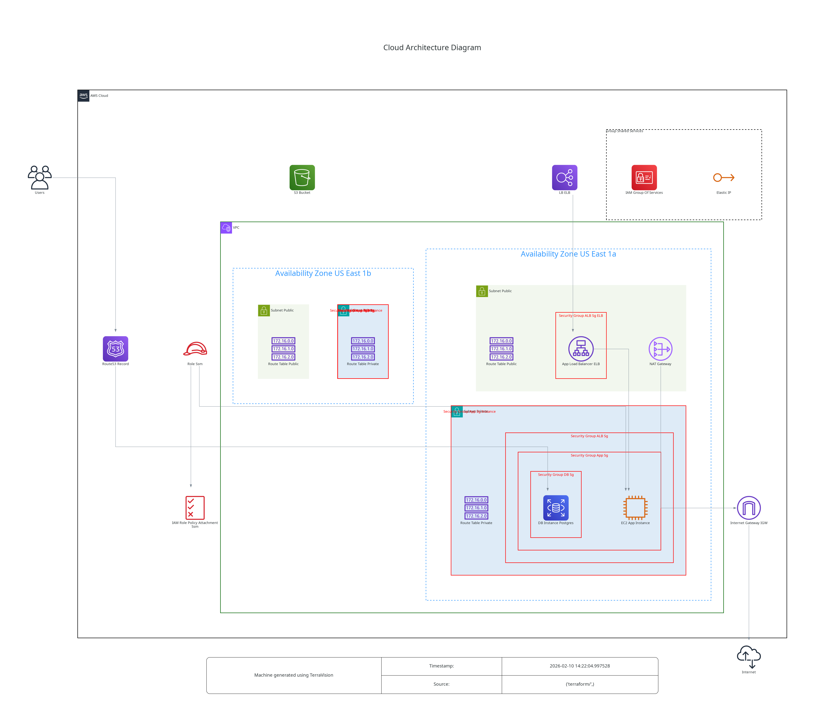

# AWS-EC2+RDS

This is an example repository containing Terraform and Ansible code. It contains the code to deploy a basic application (html web page + relational database) on a EC2 instance with `docker-compose` and RDS.  
We choose to use a EC2 instance to showcase the utilization of Ansible along with AWS SSM.

## Tree
```
.
├── ansible
│   ├── ansible.cfg            # Important here is to enable `amazon.aws.aws_ec2` plugin.
│   ├── collections
│   │   └── requirements.yml   # We need `amazon.aws.aws_ec2` and `amazon.aws.aws_ssm`.
│   ├── docker_compose.yml     # Maybe not the best name for this playbook.
│   ├── inventory
│   │   ├── aws_ec2.yml        # This file contains the `amazon.aws.aws_ec2` plugin which will generate the inventory dynamically. Note that the file name must end with _<plugin_name>.yml_.
│   │   └── group_vars
│   │       └── all.yml        # Usage of `amazon.aws.aws_ssm` and a S3 bucket declaration are mandatory for Ansible to work with AWS SSM, thus we define in group_vars so it can be used by all playbook.
│   └── roles
│       └── docker_compose
│           ├── tasks
│           │   └── main.yml
│           ├── templates
│           │   └── .env.j2
│           └── vars
│               └── main.yml
├── misc
│   └── architecture.dot.png   # Generated with https://github.com/patrickchugh/terravision.
├── README.md
└── terraform
    ├── iam.tf                 # This is needed for AWS SSM.
    ├── lb.tf                  # We are using ALB to expose our web page.
    ├── main.tf
    ├── network.tf             # At least 2 publics subnets in differents AZ are required for ALB creation. We are using NAT gateway for AWS SSM (and for instance internet connectivity).
    ├── outputs.tf
    ├── provider.tf
    ├── s3.tf                  # S3 bucket is mandatory for the utilization of Ansible along with AWS SSM.
    ├── security_group.tf
    └── variables.tf
```

## Architecture diagram



## Infracost

```shell
 Name                                                            Monthly Qty  Unit                    Monthly Cost

 module.vpc.aws_nat_gateway.this[0]
 ├─ NAT gateway                                                          730  hours                         $32.85
 └─ Data processed                                         Monthly cost depends on usage: $0.045 per GB

 module.alb.aws_lb.this[0]
 ├─ Application load balancer                                            730  hours                         $16.43
 └─ Load balancer capacity units                           Monthly cost depends on usage: $5.84 per LCU

 aws_db_instance.postgres
 ├─ Database instance (on-demand, Single-AZ, db.t3.micro)                730  hours                         $13.14
 └─ Storage (general purpose SSD, gp2)                                    20  GB                             $2.30

 aws_instance.app_instance
 ├─ Instance usage (Linux/UNIX, on-demand, t3.micro)                     730  hours                          $7.59
 └─ root_block_device
    └─ Storage (general purpose SSD, gp2)                                  8  GB                             $0.80

 aws_route53_zone.private
 └─ Hosted zone                                                            1  months                         $0.50

 aws_route53_record.db
 ├─ Standard queries (first 1B)                            Monthly cost depends on usage: $0.40 per 1M queries
 ├─ Latency based routing queries (first 1B)               Monthly cost depends on usage: $0.60 per 1M queries
 └─ Geo DNS queries (first 1B)                             Monthly cost depends on usage: $0.70 per 1M queries

 module.s3_bucket.aws_s3_bucket.this[0]
 └─ Standard
    ├─ Storage                                             Monthly cost depends on usage: $0.023 per GB
    ├─ PUT, COPY, POST, LIST requests                      Monthly cost depends on usage: $0.005 per 1k requests
    ├─ GET, SELECT, and all other requests                 Monthly cost depends on usage: $0.0004 per 1k requests
    ├─ Select data scanned                                 Monthly cost depends on usage: $0.002 per GB
    └─ Select data returned                                Monthly cost depends on usage: $0.0007 per GB

 OVERALL TOTAL                                                                                             $73.61

*Usage costs can be estimated by updating Infracost Cloud settings, see docs for other options.

──────────────────────────────────
40 cloud resources were detected:
∙ 7 were estimated
∙ 33 were free

┏━━━━━━━━━━━━━━━━━━━━━━━━━━━━━━━━━━━━━━━━━━━━━━━━━━━━┳━━━━━━━━━━━━━━━┳━━━━━━━━━━━━━┳━━━━━━━━━━━━┓
┃ Project                                            ┃ Baseline cost ┃ Usage cost* ┃ Total cost ┃
┣━━━━━━━━━━━━━━━━━━━━━━━━━━━━━━━━━━━━━━━━━━━━━━━━━━━━╋━━━━━━━━━━━━━━━╋━━━━━━━━━━━━━╋━━━━━━━━━━━━┫
┃ terraform                                          ┃           $74 ┃           - ┃        $74 ┃
┗━━━━━━━━━━━━━━━━━━━━━━━━━━━━━━━━━━━━━━━━━━━━━━━━━━━━┻━━━━━━━━━━━━━━━┻━━━━━━━━━━━━━┻━━━━━━━━━━━━┛
```

## Helpful informations

Must export database username and password before usage.
```shell
export TF_VAR_db_username=
export TF_VAR_db_password=
```
