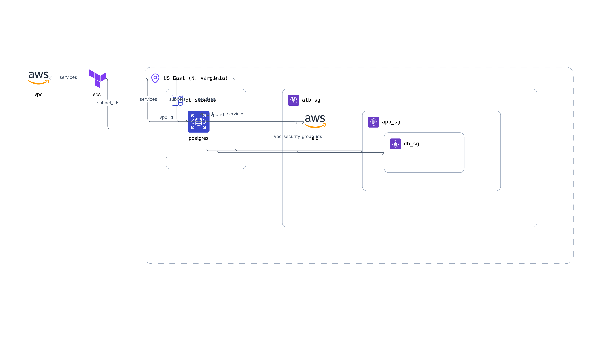

# AWS-ECS+RDS

This is an example repository containing Terraform code. It contains the code to deploy a basic application (html web page + relational database) on ECS and RDS.

## Tree
```
.
├── misc
│   └── Brainboard.png    # Generated with https://app.brainboard.co
├── README.md
└── terraform
    ├── main.tf
    ├── outputs.tf
    ├── provider.tf
    └── variables.tf
```

## Architecture diagram



## Infracost

```shell
 Name                                                         Monthly Qty  Unit              Monthly Cost

 module.vpc.aws_nat_gateway.this[0]
 ├─ NAT gateway                                                       730  hours                   $32.85
 └─ Data processed                                         Monthly cost depends on usage: $0.045 per GB

 module.alb.aws_lb.this[0]
 ├─ Application load balancer                                         730  hours                   $16.43
 └─ Load balancer capacity units                           Monthly cost depends on usage: $5.84 per LCU

 aws_db_instance.postgres
 ├─ Database instance (on-demand, Single-AZ, db.t3.micro)             730  hours                   $13.14
 └─ Storage (general purpose SSD, gp2)                                 20  GB                       $2.30

 OVERALL TOTAL                                                                                    $64.72

*Usage costs can be estimated by updating Infracost Cloud settings, see docs for other options.

──────────────────────────────────
35 cloud resources were detected:
∙ 3 were estimated
∙ 32 were free

┏━━━━━━━━━━━━━━━━━━━━━━━━━━━━━━━━━━━━━━━━━━━━━━━━━━━━┳━━━━━━━━━━━━━━━┳━━━━━━━━━━━━━┳━━━━━━━━━━━━┓
┃ Project                                            ┃ Baseline cost ┃ Usage cost* ┃ Total cost ┃
┣━━━━━━━━━━━━━━━━━━━━━━━━━━━━━━━━━━━━━━━━━━━━━━━━━━━━╋━━━━━━━━━━━━━━━╋━━━━━━━━━━━━━╋━━━━━━━━━━━━┫
┃ terraform                                          ┃           $65 ┃           - ┃        $65 ┃
┗━━━━━━━━━━━━━━━━━━━━━━━━━━━━━━━━━━━━━━━━━━━━━━━━━━━━┻━━━━━━━━━━━━━━━┻━━━━━━━━━━━━━┻━━━━━━━━━━━━┛
```

## Helpful informations

https://elasticscale.com/blog/why-your-aws-ecs-task-is-stuck-in-pendingand-what-to-do-about-it/

To get information on task in case it is stuck in `PENDING` status:
```shell
aws ecs describe-services --cluster ecs-app --services ecs-app
```

Must export database username and password before usage.
```shell
export TF_VAR_db_username=
export TF_VAR_db_password=
```
