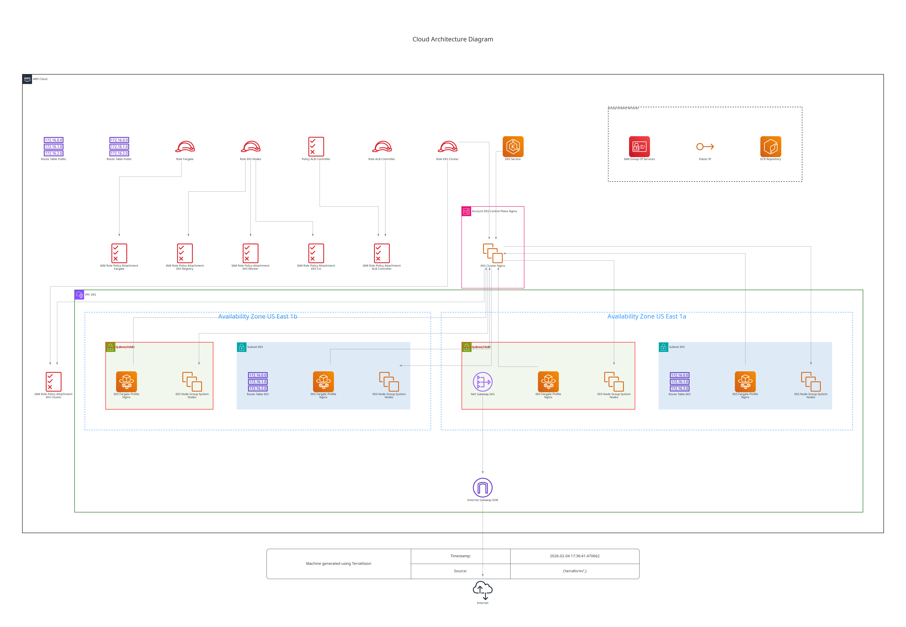

# AWS-EKS 

This is an example repository containing Terraform code. It contains the code to deploy a basic application (html web page + relational database) using EKS with an EC2 node pool for `kube-system` deployment (coredns, aws-load-balancer-controller) and a Fargate pool for the application deployment.

## Tree
```
.
├── misc
│   └── architecture.dot.png   # Generated with https://github.com/patrickchugh/terravision.
├── README.md
└── terraform
    ├── files
    │   └── html-db-values.yaml
    ├── kubernetes.tf          # We are deploying Kubernetes objects here.
    ├── main.tf
    ├── outputs.tf
    ├── provider.tf
    └── variables.tf
```

## Architecture diagram



## Infracost

```shell
 Name                                                     Monthly Qty  Unit              Monthly Cost

 aws_eks_cluster.nginx
 └─ EKS cluster                                                   730  hours                   $73.00

 aws_nat_gateway.eks
 ├─ NAT gateway                                                   730  hours                   $32.85
 └─ Data processed                                     Monthly cost depends on usage: $0.045 per GB

 aws_eks_fargate_profile.nginx
 ├─ Per GB per hour                                                 1  GB                       $3.24
 └─ Per vCPU per hour                                               1  CPU                     $29.55

 aws_eks_node_group.system_nodes
 ├─ Instance usage (Linux/UNIX, on-demand, t3.medium)             730  hours                   $30.37
 └─ Storage (general purpose SSD, gp2)                             20  GB                       $2.00

 OVERALL TOTAL                                                                               $171.01

*Usage costs can be estimated by updating Infracost Cloud settings, see docs for other options.

──────────────────────────────────
31 cloud resources were detected:
∙ 4 were estimated
∙ 27 were free

┏━━━━━━━━━━━━━━━━━━━━━━━━━━━━━━━━━━━━━━━━━━━━━━━━━━━━┳━━━━━━━━━━━━━━━┳━━━━━━━━━━━━━┳━━━━━━━━━━━━┓
┃ Project                                            ┃ Baseline cost ┃ Usage cost* ┃ Total cost ┃
┣━━━━━━━━━━━━━━━━━━━━━━━━━━━━━━━━━━━━━━━━━━━━━━━━━━━━╋━━━━━━━━━━━━━━━╋━━━━━━━━━━━━━╋━━━━━━━━━━━━┫
┃ terraform                                          ┃          $171 ┃           - ┃       $171 ┃
┗━━━━━━━━━━━━━━━━━━━━━━━━━━━━━━━━━━━━━━━━━━━━━━━━━━━━┻━━━━━━━━━━━━━━━┻━━━━━━━━━━━━━┻━━━━━━━━━━━━┛
```

## Helpful informations

Must export database username and password before usage.
```shell
export TF_VAR_db_username=
export TF_VAR_db_password=
```

Use this command to get merge the kubeconfig with `~/.kube/config`:
```shell
aws eks update-kubeconfig --name html-db --region us-east-1
```

You may need to delete `validatingwebhookconfigurations` and `mutatingwebhookconfigurations` during `terraform destroy`.
