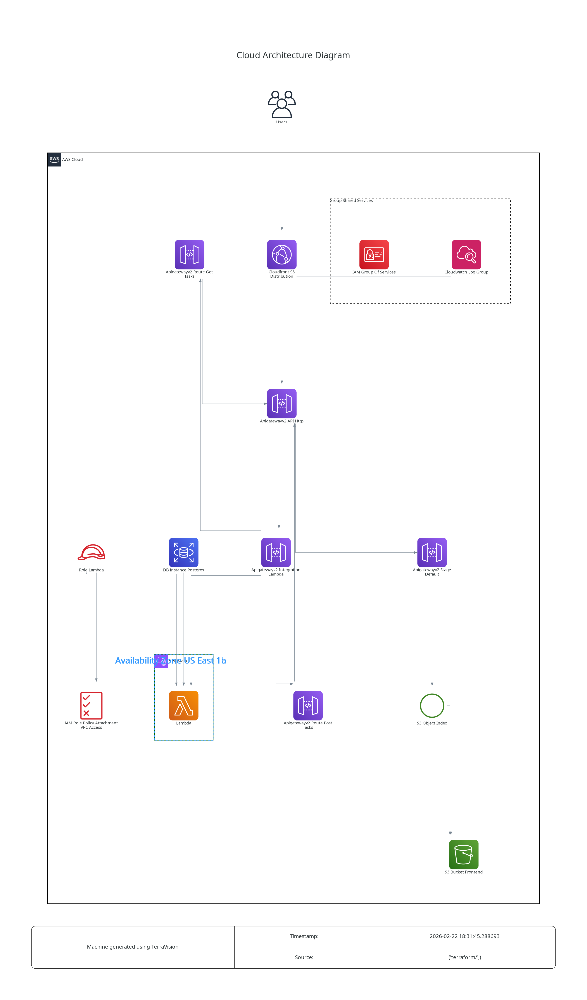

# AWS-S3+Lambda+RDS

This is an example repository containing Terraform code. It contains the code to deploy a basic application (html web page + relational database) with S3, Lambda and RDS.
We are using Api gateway and Cloudfront (mostly to avoid CORS issues) to expose the application.

## Tree
```
.
├── app
│   ├── app.py
│   ├── lambda.zip
│   ├── requirements.txt
│   └── zip.sh                # Helper script to run to generate lambda.zip
├── misc
│   └── architecture.dot.png  # Generated with https://github.com/patrickchugh/terravision.
├── README.md
└── terraform
    ├── iam.tf
    ├── main.tf
    ├── network.tf
    ├── outputs.tf
    ├── provider.tf
    ├── s3.tf
    ├── security_group.tf
    ├── templates
    │   └── index.html.tftpl
    └── variables.tf
```

## Architecture diagram



## Infracost

```shell
 Name                                                              Monthly Qty  Unit                        Monthly Cost

 aws_db_instance.postgres
 ├─ Database instance (on-demand, Single-AZ, db.t3.micro)                  730  hours                             $13.14
 └─ Storage (general purpose SSD, gp2)                                      20  GB                                 $2.30

 aws_apigatewayv2_api.http
 └─ Requests (first 300M)                                  Monthly cost depends on usage: $1.00 per 1M requests

 aws_cloudfront_distribution.s3_distribution
 ├─ Invalidation requests (first 1k)                       Monthly cost depends on usage: $0.00 per paths
 └─ US, Mexico, Canada
    ├─ Data transfer out to internet (first 10TB)          Monthly cost depends on usage: $0.085 per GB
    ├─ Data transfer out to origin                         Monthly cost depends on usage: $0.02 per GB
    ├─ HTTP requests                                       Monthly cost depends on usage: $0.0075 per 10k requests
    └─ HTTPS requests                                      Monthly cost depends on usage: $0.01 per 10k requests

 aws_lambda_function.this
 ├─ Requests                                               Monthly cost depends on usage: $0.20 per 1M requests
 ├─ Ephemeral storage                                      Monthly cost depends on usage: $0.0000000309 per GB-seconds
 └─ Duration (first 6B)                                    Monthly cost depends on usage: $0.0000166667 per GB-seconds

 aws_s3_bucket.frontend
 └─ Standard
    ├─ Storage                                             Monthly cost depends on usage: $0.023 per GB
    ├─ PUT, COPY, POST, LIST requests                      Monthly cost depends on usage: $0.005 per 1k requests
    ├─ GET, SELECT, and all other requests                 Monthly cost depends on usage: $0.0004 per 1k requests
    ├─ Select data scanned                                 Monthly cost depends on usage: $0.002 per GB
    └─ Select data returned                                Monthly cost depends on usage: $0.0007 per GB

 OVERALL TOTAL                                                                                                   $15.44

*Usage costs can be estimated by updating Infracost Cloud settings, see docs for other options.

──────────────────────────────────
22 cloud resources were detected:
∙ 5 were estimated
∙ 17 were free

┏━━━━━━━━━━━━━━━━━━━━━━━━━━━━━━━━━━━━━━━━━━━━━━━━━━━━┳━━━━━━━━━━━━━━━┳━━━━━━━━━━━━━┳━━━━━━━━━━━━┓
┃ Project                                            ┃ Baseline cost ┃ Usage cost* ┃ Total cost ┃
┣━━━━━━━━━━━━━━━━━━━━━━━━━━━━━━━━━━━━━━━━━━━━━━━━━━━━╋━━━━━━━━━━━━━━━╋━━━━━━━━━━━━━╋━━━━━━━━━━━━┫
┃ terraform                                          ┃           $15 ┃           - ┃        $15 ┃
┗━━━━━━━━━━━━━━━━━━━━━━━━━━━━━━━━━━━━━━━━━━━━━━━━━━━━┻━━━━━━━━━━━━━━━┻━━━━━━━━━━━━━┻━━━━━━━━━━━━┛
```

## Helpful informations

Must export database username and password before usage.
```shell
export TF_VAR_db_username=
export TF_VAR_db_password=
```
