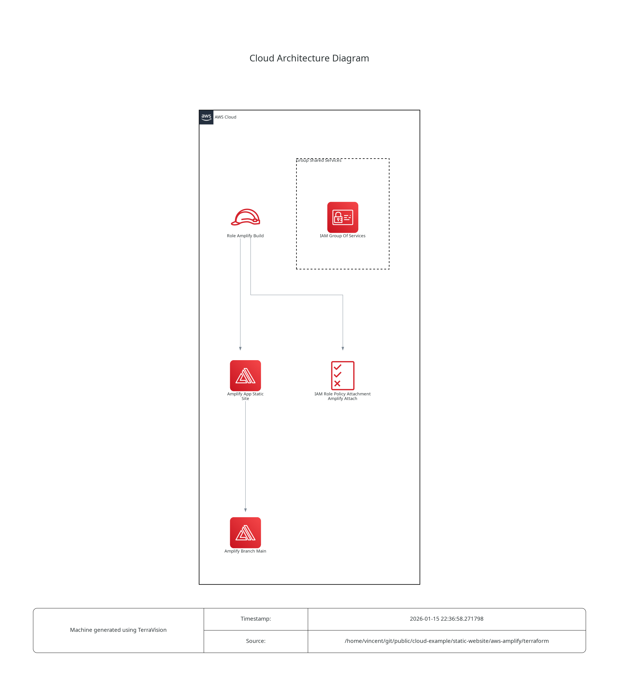

# AWS-Amplify

This is an example repository containing Terraform code. It contains the code to deploy a static web page using AWS Amplify.  

## Tree
```
.
├── misc
│   └── architecture.dot.png   # Generated with https://github.com/patrickchugh/terravision
├── README.md
├── terraform
│   ├── iam.tf
│   ├── main.tf
│   ├── provider.tf
│   └── variables.tf
└── website
    └── index.html
```

## Architecture diagram



## Helpful informations

Note that AWS Amplify does not support GitHub fine-grained personal access tokens. Classic tokens minimal required privilieges are `repo` and `admin:repo_hook`.
