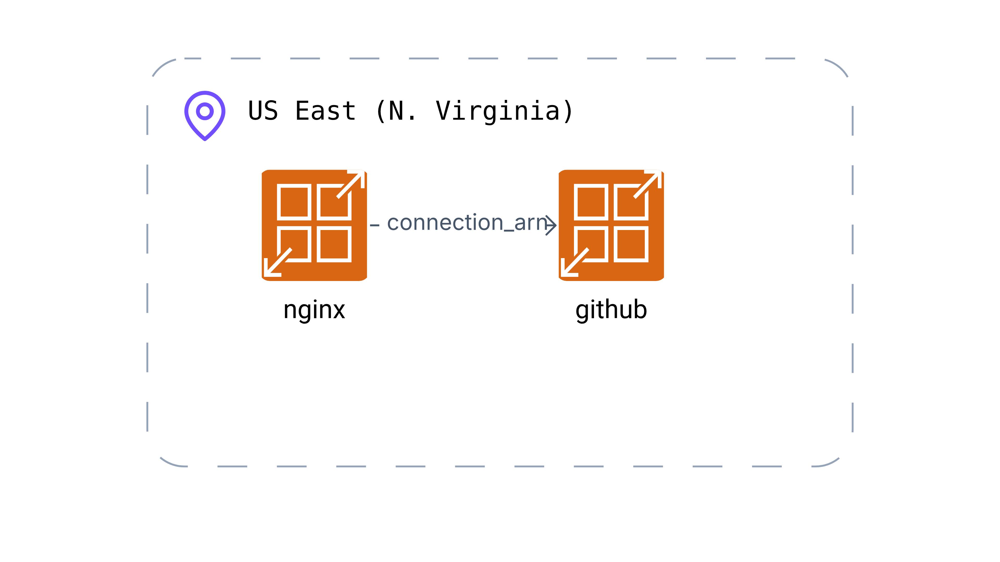
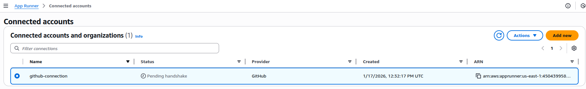

# AWS-App-Runner

This is an example repository containing Terraform code. It contains the code to deploy a static web page using AWS App Runner.

## Tree
```
.
├── app
│   ├── app.py
│   ├── apprunner.yaml
│   └── requirements.txt
├── misc
│   └── Brainboard.png   # Generated with https://app.brainboard.co
│   └── handshake.png
├── README.md
└── terraform
    ├── main.tf
    ├── outputs.tf
    ├── provider.tf
    └── variables.tf
```

## Architecture diagram



## Helpful informations

Note that AWS App Runner does not support pulling image from other source than ECR. That's why we are using GitHub repository url. Even if the GitHub repository is public, you will need to complete pending handshake manually. 


