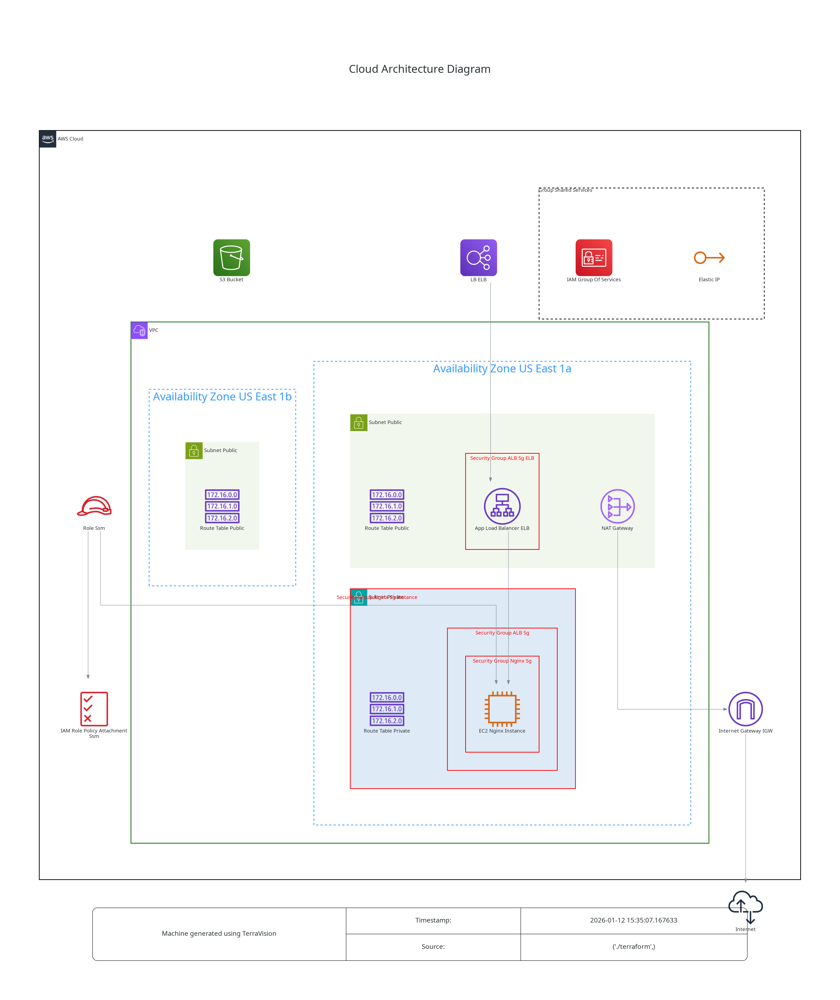

# AWS-EC2 

This is an example repository containing Terraform and Ansible code. It contains the code to deploy a static web page using Nginx on a EC2 instance.  
We choose to use a EC2 instance to showcase the utilization of Ansible along with AWS SSM.

## Tree
```
.
├── ansible
│   ├── ansible.cfg            # Important here is to enable `amazon.aws.aws_ec2` plugin.
│   ├── collections
│   │   └── requirements.yml   # We need `amazon.aws.aws_ec2` and `amazon.aws.aws_ssm`.
│   ├── inventory
│   │   ├── aws_ec2.yml        # This file contains the `amazon.aws.aws_ec2` plugin which will generate the inventory dynamically. Note that the file name must end with _<plugin_name>.yml_.
│   │   └── group_vars
│   │       └── all.yml        # Usage of `amazon.aws.aws_ssm` and a S3 bucket declaration are mandatory for Ansible to work with AWS SSM, thus we define in group_vars so it can be used by all playbook.
│   ├── nginx.yml
│   └── roles
│       └── nginx
│           ├── files
│           │   └── index.html
│           ├── handlers
│           │   └── main.yml
│           └── tasks
│               └── main.yml
├── misc
│   └── architecture.dot.png   # Generated with https://github.com/patrickchugh/terravision.
├── README.md
└── terraform
    ├── iam.tf                 # This is needed for AWS SSM.
    ├── lb.tf                  # We are using ALB to expose our web page.
    ├── main.tf
    ├── network.tf             # At least 2 publics subnets in differents AZ are required for ALB creation. We are using NAT gateway for AWS SSM (and for instance internet connectivity).
    ├── provider.tf
    ├── s3.tf                  # S3 bucket is mandatory for the utilization of Ansible along with AWS SSM.
    └── security_group.tf
```

## Architecture diagram



## Helpful informations

https://medium.com/@bisinet/ansible-without-ssh-in-aws-77b5632d1fb1
