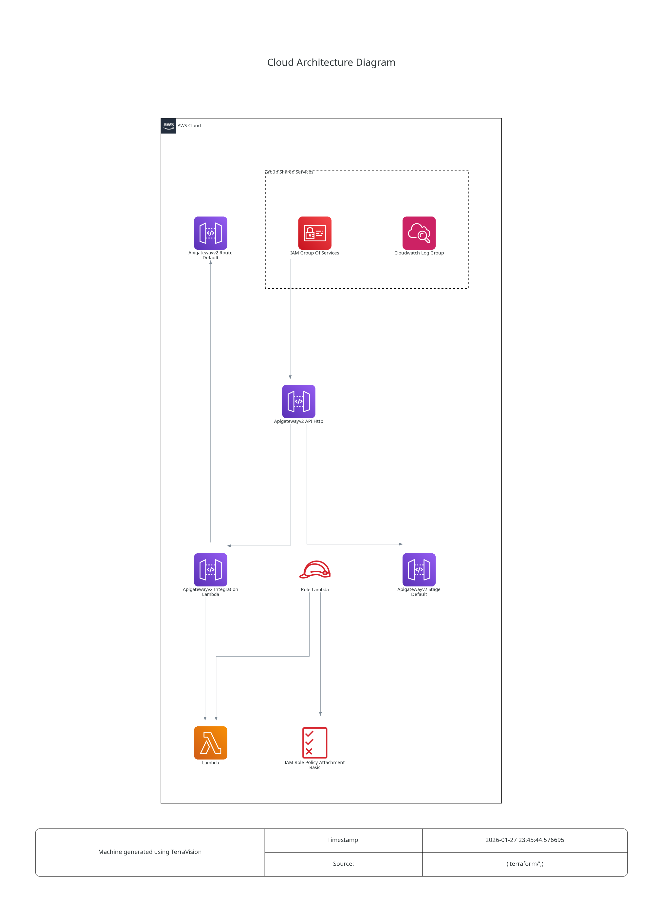

# AWS-Lambda

This is an example repository containing Terraform code. It contains the code to deploy a static web page using AWS Lambda.

## Tree
```
.
├── app
│   ├── app.py
│   ├── lambda.zip
│   ├── requirements.txt
│   └── zip.sh                # Helper script to run to generate lambda.zip
├── misc
│   └── architecture.dot.png  # Generated with https://github.com/patrickchugh/terravision.
├── README.md
└── terraform
    ├── iam.tf
    ├── main.tf
    ├── outputs.tf
    ├── provider.tf
    └── variables.tf
```

## Architecture diagram



## Helpful informations

Use follow json to run event test for debug.
```json
{
  "version": "2.0",
  "routeKey": "$default",
  "rawPath": "/",
  "rawQueryString": "",
  "headers": {},
  "requestContext": {
    "http": {
      "method": "GET",
      "path": "/",
      "protocol": "HTTP/1.1",
      "sourceIp": "127.0.0.1",
      "userAgent": "curl/7.68.0"
    }
  },
  "isBase64Encoded": false
}
```
