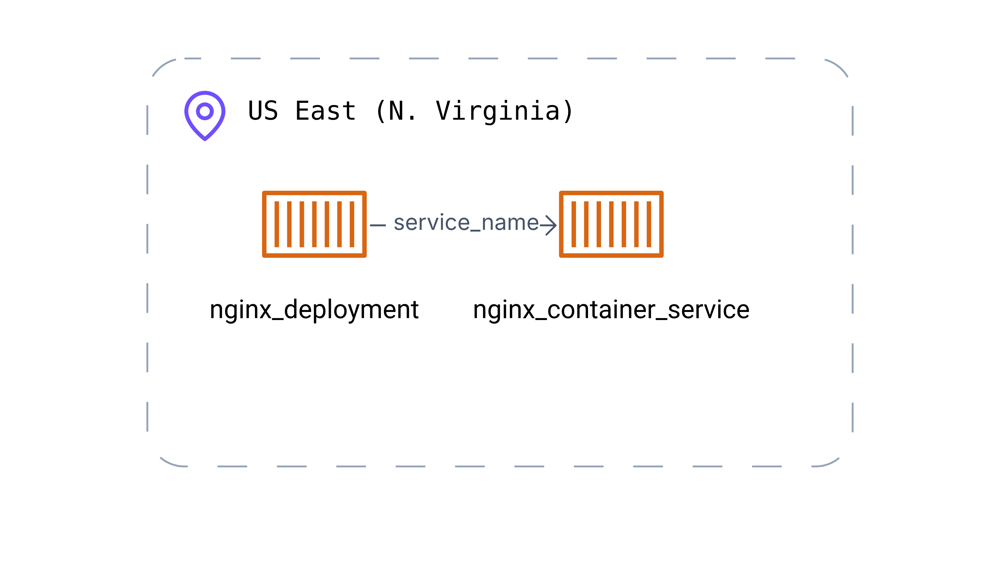

# AWS-Lightsail

This is an example repository containing Terraform code. It contains the code to deploy a static web page using AWS Lightsail.

## Tree
```
.
├── docker
│   ├── Dockerfile
│   └── index.html
├── misc
│   └── Brainboard.png # Generated with https://app.brainboard.co
├── README.md
└── terraform
    ├── main.tf
    ├── outputs.tf
    ├── provider.tf
    └── variables.tf
```

## Architecture diagram


